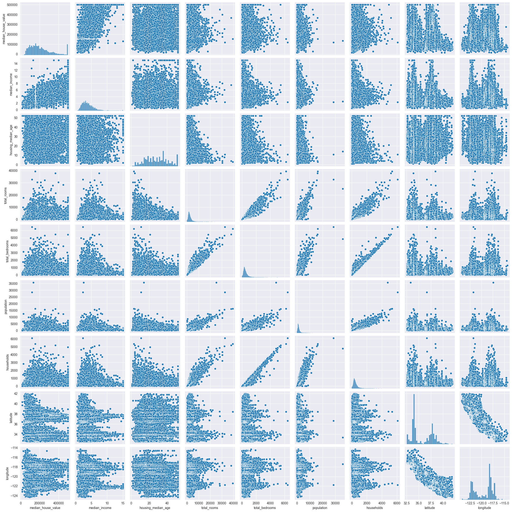
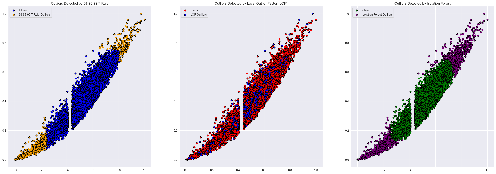
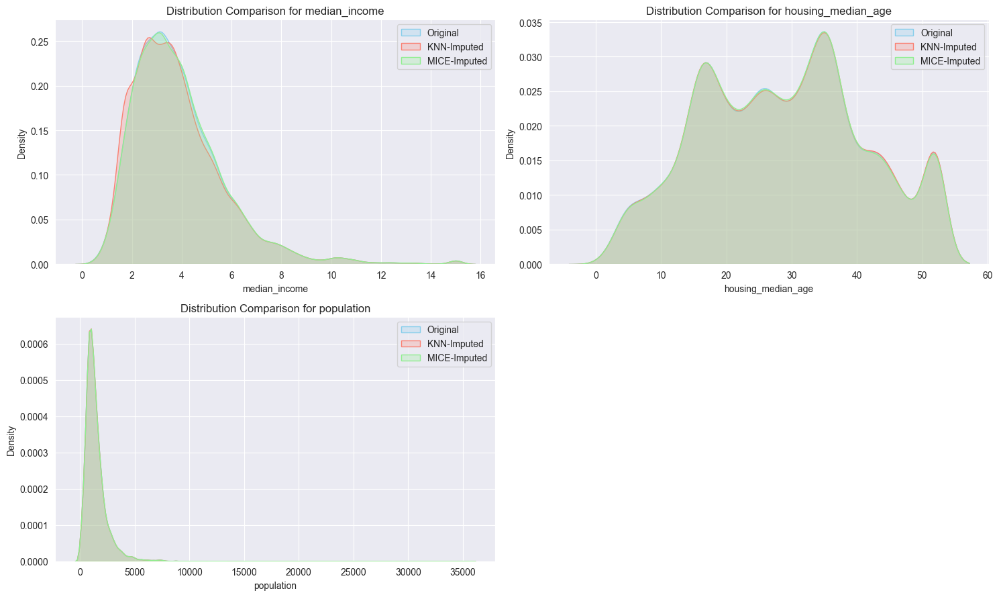
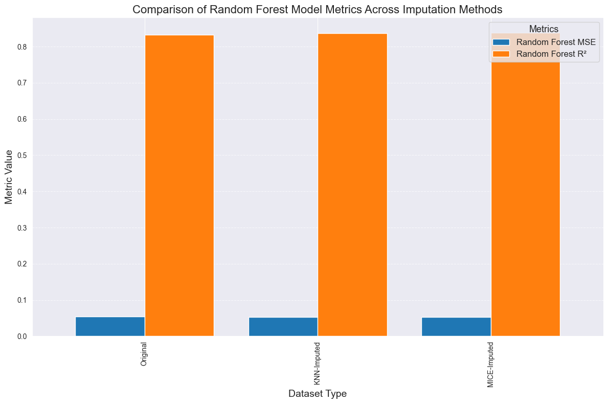

# Housing Predictive Analysis Project

This project focuses on predictive analytics for housing prices, specifically targeting the prediction of the `median_house_value`. The analysis includes data exploration, outlier detection, imputation methods, and regression modeling. We utilize various data processing techniques and compare different imputation strategies to assess their impact on predictive performance.

---

## Table of Contents
1. [Data Understanding](#data-understanding)
2. [Outlier Identification](#outlier-identification)
3. [Imputation](#imputation)
4. [Regression Modeling](#regression-modeling)
5. [Conclusions](#conclusions)

---

## 1. Data Understanding

In this section, we conducted an **Exploratory Data Analysis (EDA)** to understand and describe the raw dataset.

- **Objective**: Identify the key characteristics of the dataset, including distributions of features, presence of missing values, and potential outliers.

### Key Steps in EDA
- **Descriptive Statistics**: Calculated summary statistics (mean, median, standard deviation) for numerical features to understand data distributions.
- **Visualization of Feature Distributions**: Used histograms and KDE plots to observe distributions, identify skewness, and understand the variability within features.

**Visualization Examples**:
- **Histograms** for important features like `median_income`, `housing_median_age`, and `population` to observe their distributions.
  
  

- **Missing Value Analysis**: Identified missing data percentages for each feature. This helped us decide which features would require imputation or removal.

- **Outliers**: Visually inspected potential outliers in features using density plots and box plots. This preliminary inspection informed the need for a more systematic outlier detection approach.

---

## 2. Outlier Identification

After identifying potential outliers through visual inspection, we implemented both **statistical** and **algorithmic outlier detection methods** to make data-driven decisions on handling them.

### Outlier Detection Approaches
1. **Statistical Approach**:
   - We used the **68-95-99.7 Rule** (based on z-scores) and **Median Absolute Deviation (MAD)** to flag values falling outside expected ranges.
   - This approach is straightforward and helps capture extreme values, particularly in normally distributed data.

2. **Algorithmic Approach**:
   - Implemented **Local Outlier Factor (LOF)** to detect anomalies based on the local density of data points.
   - LOF is useful for detecting data points that deviate significantly from their neighbors, making it ideal for complex, non-linear data patterns.

### Outlier Detection Results
- **Comparison of Statistical and Algorithmic Methods**:
  - We observed that the **statistical method** captured extreme outliers efficiently but was sensitive to skewed distributions.
  - **LOF**, on the other hand, performed better in detecting contextual outliers within clusters.

**Visualization of Outliers**:
- Generated **LOF scatter plots** to compare outliers detected by each method.

  

- **Decision**: Based on the results, we decided to impute or remove certain outliers to ensure they didn't adversely affect model performance.

---

## 3. Imputation

Missing data was handled through **two imputation techniques**: **K-Nearest Neighbors (KNN)** and **MICE (Multiple Imputation by Chained Equations)**.

### Imputation Strategy
- **Identify Features for Imputation vs. Removal**:
  - Features with a low percentage of missing values were imputed, while those with a high percentage were removed.
  - This decision was based on a threshold analysis of missing data percentages.

- **KNN Imputation**:
  - KNN Imputation was used to fill missing values based on the feature similarities, preserving local data relationships.

- **MICE Imputation**:
  - MICE uses iterative regression models to impute missing values, which can capture more complex relationships but sometimes introduces smoothing effects.

### Imputation Comparison
- Compared the distributions of features in the original dataset, KNN-imputed dataset, and MICE-imputed dataset.

**Visualization of Imputed Data**:
- **KDE Plots** for `median_income`, `housing_median_age`, and `population` were used to visualize the effect of imputation on data distributions.

  

---

## 4. Regression Modeling

After imputing missing values, we built **regression models** to predict `median_house_value` using **Random Forest Regressor**. Each model was trained on a different dataset:

1. **Original (Non-Imputed)**: Dropped rows with missing values.
2. **KNN-Imputed**: Dataset with missing values filled using KNN.
3. **MICE-Imputed**: Dataset with missing values filled using MICE.

### Model Evaluation
- **Metrics**: We evaluated the models using **Mean Squared Error (MSE)** and **R²**.
- **Objective**: Assess how each imputation method impacted predictive performance.

### Results Summary

| Dataset       | Random Forest MSE | Random Forest R² |
|---------------|-------------------|------------------|
| Original      | 0.053848          | 0.833097         |
| KNN-Imputed   | 0.052856          | 0.836169         |
| MICE-Imputed  | 0.052231          | 0.838108         |

- **Observations**:
  - MICE-Imputed data achieved a slightly higher R², indicating better predictive accuracy.
  - KNN Imputed data also performed well, though it introduced some smoothing that may affect non-linear patterns.

**Model Performance Visualization**:
- **Bar Chart** comparing MSE and R² across models trained on Original, KNN-imputed, and MICE-imputed datasets.

  

---

## 5. Conclusions

### Key Takeaways
- **Imputation Impact**: KNN imputation worked well due to local data relationships, while MICE provided similar results but with some smoothing effects.
- **Outlier Detection**: Statistical methods were effective for extreme values, while LOF identified more nuanced anomalies, making it suitable for complex data.
- **Model Performance**: Tree-based models like Random Forest provided robust predictions, with imputed data yielding comparable R² scores to the non-imputed data.

### Recommendations
- **KNN Imputation** is recommended for datasets with strong local relationships.
- **Algorithmic Outlier Detection** is beneficial for complex datasets, especially when combined with statistical methods.

### Challenges
- **MICE Convergence**: Encountered convergence warnings, which required parameter tuning for stable imputation.

---

## How to Run This Project

1. **Clone the Repository**:
   ```bash
   git clone <https://github.com/Shreyas8612/Predictive_Analytics.git>
2. **Install the Required Packages**:
   ```bash
   pip install -r requirements.txt
3. **Run the Jupyter Notebook**:
   Open `housing_analysis.ipynb` in Jupyter Notebook and run the cells sequentially.